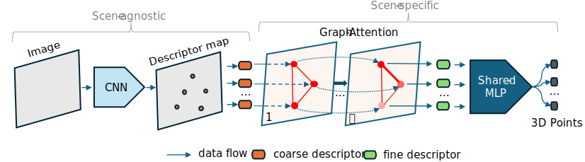

# D2S: Representing sparse descriptors and 3D coordinates for camera relocalization
### [Project Page](https://thpjp.github.io/d2s/) | [Paper](https://arxiv.org/pdf/2307.15250.pdf)
<br/>

- [Introduction](#introduction)
- [Installation](#installation)
- [Dataset](#dataset)
    - [Supported Datasets](#supported-datasets)
    - [Download preprocessed datasets](#Download_preprocessed_datasets)
- [Evaluation](#Evaluation-with-pre-trained-models)
- [Training](#Training)
- [BibTex Citation](#bibTex-citation)

## Introduction  
D2S is a learning-based visual re-localization method. It concentrates on learning to generate 3D scene coordinates from sparse descriptors extracted from a single image. Once trained for a specific sparse SfM scene, D2S can accurately estimate the camera’s position and orientation from a new image of the scene. D2S also serves as a natural filter for outliers and non-robust descriptors, resulting in an enhanced localization accuracy down the line.

<p align="center">

<p>

<p align="center">

<p>

This repository contains the Pytorch implementation of our papers: 
- [D2S: Representing Sparse Descriptors and 3D Coordinates for Camera Relocalization](https://thpjp.github.io/d2s/)
- [Fast and Lightweight Scene Regressor for Camera Relocalization](https://arxiv.org/abs/2212.01830) (feat2map branch)

## Installation
D2S is based on PyTorch. The main framework is implemented in Python.
Python 3.9 + required packages
```
git clone https://github.com/ais-lab/d2s.git
conda create --name d2s python=3.9
conda activate d2s
# Refer to https://pytorch.org/get-started/previous-versions/ to install pytorch compatible with your CUDA
python -m pip install torch==1.12.0 torchvision==0.13.0 
python -m pip install -r requirements.txt
```

D2S uses [hierarchical localization toolbox](https://github.com/cvg/Hierarchical-Localization)(hloc) to label descriptors coordinates. However, we provided scripts to download all preprocessed datasets for an immediate run. 

## Dataset 
### Supported Datasets
 - [7scenes](https://www.microsoft.com/en-us/research/project/rgb-d-dataset-7-scenes/)
 - [Indoor6](https://github.com/microsoft/SceneLandmarkLocalization)
 - [Cambridge Landmarks](http://mi.eng.cam.ac.uk/projects/relocalisation/#dataset)
 - [BKC Ritsumeikan](https://drive.google.com/file/d/1XEdnrFTzThruG15pW2A_1jYAxtpYbwq5/view?usp=sharing)

### Download preprocessed datasets
Please run the provided scripts to prepare and download the data which has been preprocessed by running:

7scenes
```
./prepare_scripts/seven_scenes.sh
```
Cambridge Landmarks
```
./prepare_scripts/cambridge.sh 
```
Indoor-6
```
./prepare_scripts/indoor6.sh
```

## Evaluation with pre-trained models
Please download the pre-trained models by running:
```
./prepare_scripts/download_pre_trained_models.sh
```
For example, to evaluate KingsCollege scene:
```
python runners/eval.py --dataset indoor6 --scene scene1 -expv d2s
```

You can receive a result like this:

<p align="center">

<p>

For pre-trained models of 7scenes, you can download it from [here](https://drive.google.com/file/d/1bQNctr2lpFVIhw2DjAmcpzwE-RdRD-yG/view?usp=sharing)

## Training
```
python runners/train.py --dataset indoor6 --scene scene1 -expv d2s
```

## BibTex Citation 
If you find this project useful, please cite:
```
@article{bui2024d2s,
  title={D2S: Representing sparse descriptors and 3D coordinates for camera relocalization},
  author={Bui, Bach-Thuan and Bui, Huy-Hoang and Tran, Dinh-Tuan and Lee, Joo-Ho},
  journal={IEEE Robotics and Automation Letters},
  year={2024}
}
@article{bui2022fast,
  title={Fast and Lightweight Scene Regressor for Camera Relocalization},
  author={Bui, Thuan B and Tran, Dinh-Tuan and Lee, Joo-Ho},
  journal={arXiv preprint arXiv:2212.01830},
  year={2022}
}
```
